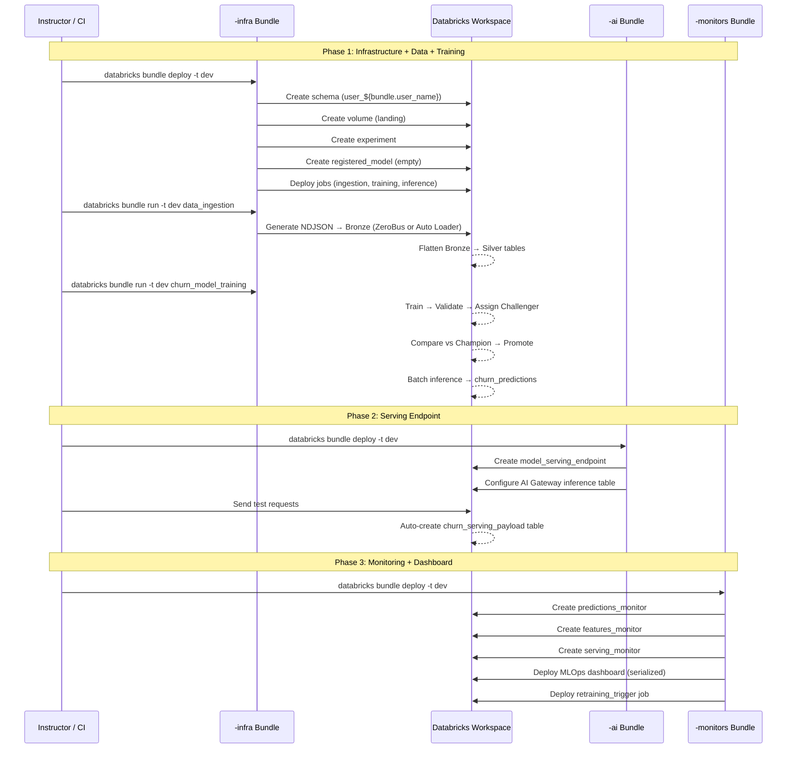

# 01 — Three-Bundle Deployment Sequence

```mermaid
sequenceDiagram
    participant Instructor as Instructor / CI
    participant Infra as -infra Bundle
    participant Workspace as Databricks Workspace
    participant AI as -ai Bundle
    participant Monitors as -monitors Bundle

    Note over Instructor,Monitors: Phase 1: Infrastructure + Data + Training

    Instructor->>Infra: databricks bundle deploy -t dev
    Infra->>Workspace: Create schema (user_${bundle.user_name})
    Infra->>Workspace: Create volume (landing)
    Infra->>Workspace: Create experiment
    Infra->>Workspace: Create registered_model (empty)
    Infra->>Workspace: Deploy jobs (ingestion, training, inference)

    Instructor->>Infra: databricks bundle run -t dev data_ingestion
    Infra->>Workspace: Generate NDJSON → Bronze (ZeroBus or Auto Loader)
    Workspace-->>Workspace: Flatten Bronze → Silver tables

    Instructor->>Infra: databricks bundle run -t dev churn_model_training
    Workspace-->>Workspace: Train → Validate → Assign Challenger
    Workspace-->>Workspace: Compare vs Champion → Promote
    Workspace-->>Workspace: Batch inference → churn_predictions

    Note over Instructor,Monitors: Phase 2: Serving Endpoint

    Instructor->>AI: databricks bundle deploy -t dev
    AI->>Workspace: Create model_serving_endpoint
    AI->>Workspace: Configure AI Gateway inference table
    Instructor->>Workspace: Send test requests
    Workspace-->>Workspace: Auto-create churn_serving_payload table

    Note over Instructor,Monitors: Phase 3: Monitoring + Dashboard

    Instructor->>Monitors: databricks bundle deploy -t dev
    Monitors->>Workspace: Create predictions_monitor
    Monitors->>Workspace: Create features_monitor
    Monitors->>Workspace: Create serving_monitor
    Monitors->>Workspace: Deploy MLOps dashboard (serialized)
    Monitors->>Workspace: Deploy retraining_trigger job
```
