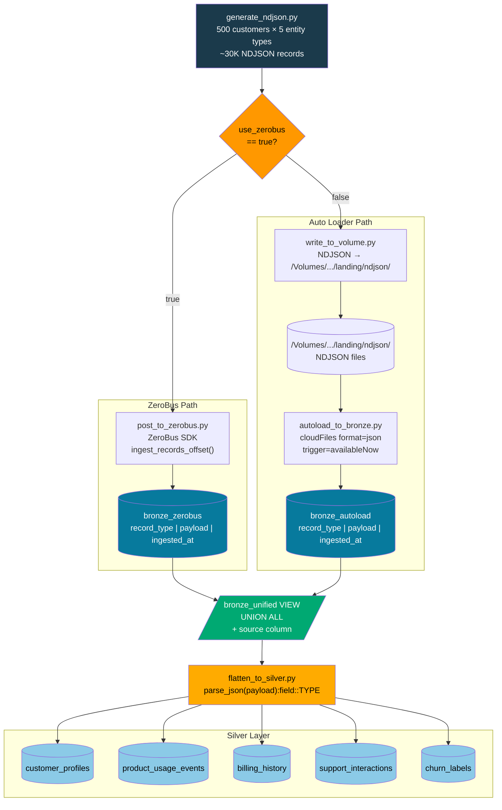

# 02 — Dual-Path Data Ingestion Flow

```mermaid
flowchart TD
    GEN["generate_ndjson.py<br/>500 customers × 5 entity types<br/>~30K NDJSON records"]

    GATE{"use_zerobus<br/>== true?"}

    subgraph ZeroBus Path
        ZB_POST["post_to_zerobus.py<br/>ZeroBus SDK<br/>ingest_records_offset()"]
        ZB_BRONZE[("bronze_zerobus<br/>record_type | payload | ingested_at")]
    end

    subgraph Auto Loader Path
        VOL_WRITE["write_to_volume.py<br/>NDJSON → /Volumes/.../landing/ndjson/"]
        VOL[("/Volumes/.../landing/ndjson/<br/>NDJSON files")]
        AL["autoload_to_bronze.py<br/>cloudFiles format=json<br/>trigger=availableNow"]
        AL_BRONZE[("bronze_autoload<br/>record_type | payload | ingested_at")]
    end

    UNIFIED[/"bronze_unified VIEW<br/>UNION ALL<br/>+ source column"/]

    subgraph Silver Layer
        CP[("customer_profiles")]
        UE[("product_usage_events")]
        BH[("billing_history")]
        SI[("support_interactions")]
        CL[("churn_labels")]
    end

    FLATTEN["flatten_to_silver.py<br/>parse_json(payload):field::TYPE"]

    GEN --> GATE
    GATE -->|true| ZB_POST --> ZB_BRONZE --> UNIFIED
    GATE -->|false| VOL_WRITE --> VOL --> AL --> AL_BRONZE --> UNIFIED
    UNIFIED --> FLATTEN
    FLATTEN --> CP
    FLATTEN --> UE
    FLATTEN --> BH
    FLATTEN --> SI
    FLATTEN --> CL

    style GEN fill:#1B3A4B,color:#fff
    style GATE fill:#FF9800,color:#000
    style ZB_BRONZE fill:#077A9D,color:#fff
    style AL_BRONZE fill:#077A9D,color:#fff
    style UNIFIED fill:#00A972,color:#fff
    style FLATTEN fill:#FFAB00,color:#000
    style CP fill:#8BCAE7,color:#000
    style UE fill:#8BCAE7,color:#000
    style BH fill:#8BCAE7,color:#000
    style SI fill:#8BCAE7,color:#000
    style CL fill:#8BCAE7,color:#000
```
