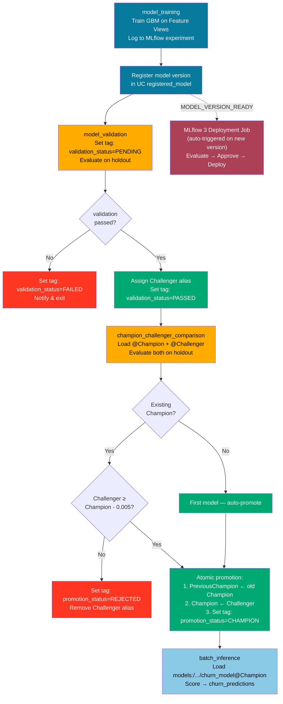

# 03 — Champion/Challenger Model Promotion Flow

```mermaid
flowchart TD
    TRAIN["model_training<br/>Train GBM on Feature Views<br/>Log to MLflow experiment"]
    REG["Register model version<br/>in UC registered_model"]
    VAL["model_validation<br/>Set tag: validation_status=PENDING<br/>Evaluate on holdout"]

    VAL_GATE{"validation<br/>passed?"}
    VAL_FAIL["Set tag: validation_status=FAILED<br/>Notify & exit"]

    ASSIGN_CHALLENGER["Assign Challenger alias<br/>Set tag: validation_status=PASSED"]

    COMPARE["champion_challenger_comparison<br/>Load @Champion + @Challenger<br/>Evaluate both on holdout"]

    HAS_CHAMP{"Existing<br/>Champion?"}
    FIRST["First model — auto-promote"]

    COMPARE_GATE{"Challenger ≥<br/>Champion - 0.005?"}
    REJECT["Set tag: promotion_status=REJECTED<br/>Remove Challenger alias"]

    PROMOTE["Atomic promotion:<br/>1. PreviousChampion ← old Champion<br/>2. Champion ← Challenger<br/>3. Set tag: promotion_status=CHAMPION"]

    BATCH["batch_inference<br/>Load models:/.../churn_model@Champion<br/>Score → churn_predictions"]

    DEPLOY_JOB["MLflow 3 Deployment Job<br/>(auto-triggered on new version)<br/>Evaluate → Approve → Deploy"]

    TRAIN --> REG --> VAL --> VAL_GATE
    VAL_GATE -->|No| VAL_FAIL
    VAL_GATE -->|Yes| ASSIGN_CHALLENGER --> COMPARE
    COMPARE --> HAS_CHAMP
    HAS_CHAMP -->|No| FIRST --> PROMOTE
    HAS_CHAMP -->|Yes| COMPARE_GATE
    COMPARE_GATE -->|No| REJECT
    COMPARE_GATE -->|Yes| PROMOTE
    PROMOTE --> BATCH

    REG -.->|MODEL_VERSION_READY| DEPLOY_JOB

    style TRAIN fill:#077A9D,color:#fff
    style REG fill:#077A9D,color:#fff
    style VAL fill:#FFAB00,color:#000
    style ASSIGN_CHALLENGER fill:#00A972,color:#fff
    style COMPARE fill:#FFAB00,color:#000
    style PROMOTE fill:#00A972,color:#fff
    style BATCH fill:#8BCAE7,color:#000
    style VAL_FAIL fill:#FF3621,color:#fff
    style REJECT fill:#FF3621,color:#fff
    style DEPLOY_JOB fill:#AB4057,color:#fff
    style FIRST fill:#00A972,color:#fff
```
