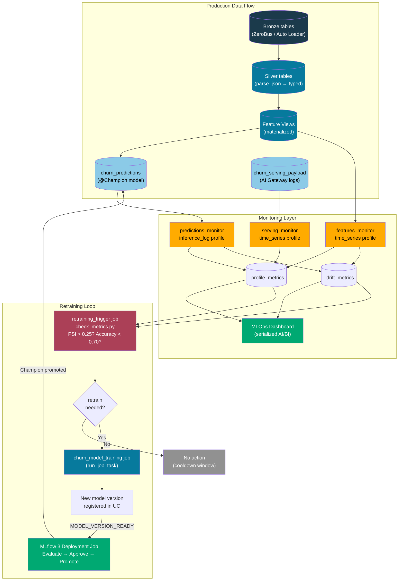

# 04 — Closed-Loop Retraining Architecture

```mermaid
flowchart TD
    subgraph Production Data Flow
        BRONZE[("Bronze tables<br/>(ZeroBus / Auto Loader)")]
        SILVER[("Silver tables<br/>(parse_json → typed)")]
        FEATURES[("Feature Views<br/>(materialized)")]
        PREDICTIONS[("churn_predictions<br/>(@Champion model)")]
        SERVING[("churn_serving_payload<br/>(AI Gateway logs)")]
    end

    subgraph Monitoring Layer
        PM["predictions_monitor<br/>inference_log profile"]
        FM["features_monitor<br/>time_series profile"]
        SM["serving_monitor<br/>time_series profile"]
        DASH["MLOps Dashboard<br/>(serialized AI/BI)"]
        PROF[("_profile_metrics")]
        DRIFT[("_drift_metrics")]
    end

    subgraph Retraining Loop
        TRIGGER["retraining_trigger job<br/>check_metrics.py<br/>PSI > 0.25? Accuracy < 0.70?"]
        TRIGGER_GATE{"retrain<br/>needed?"}
        TRAINING["churn_model_training job<br/>(run_job_task)"]
        NEW_VER["New model version<br/>registered in UC"]
        DEPLOY["MLflow 3 Deployment Job<br/>Evaluate → Approve → Promote"]
    end

    BRONZE --> SILVER --> FEATURES --> PREDICTIONS
    PREDICTIONS --> PM
    FEATURES --> FM
    SERVING --> SM

    PM --> PROF --> DASH
    PM --> DRIFT --> DASH
    FM --> PROF
    FM --> DRIFT
    SM --> PROF

    DRIFT --> TRIGGER
    PROF --> TRIGGER
    TRIGGER --> TRIGGER_GATE
    TRIGGER_GATE -->|No| STOP["No action<br/>(cooldown window)"]
    TRIGGER_GATE -->|Yes| TRAINING
    TRAINING --> NEW_VER
    NEW_VER -->|MODEL_VERSION_READY| DEPLOY
    DEPLOY -->|Champion promoted| PREDICTIONS

    style BRONZE fill:#1B3A4B,color:#fff
    style SILVER fill:#077A9D,color:#fff
    style FEATURES fill:#077A9D,color:#fff
    style PREDICTIONS fill:#8BCAE7,color:#000
    style SERVING fill:#8BCAE7,color:#000
    style PM fill:#FFAB00,color:#000
    style FM fill:#FFAB00,color:#000
    style SM fill:#FFAB00,color:#000
    style DASH fill:#00A972,color:#fff
    style TRIGGER fill:#AB4057,color:#fff
    style TRAINING fill:#077A9D,color:#fff
    style DEPLOY fill:#00A972,color:#fff
    style STOP fill:#919191,color:#fff
```
