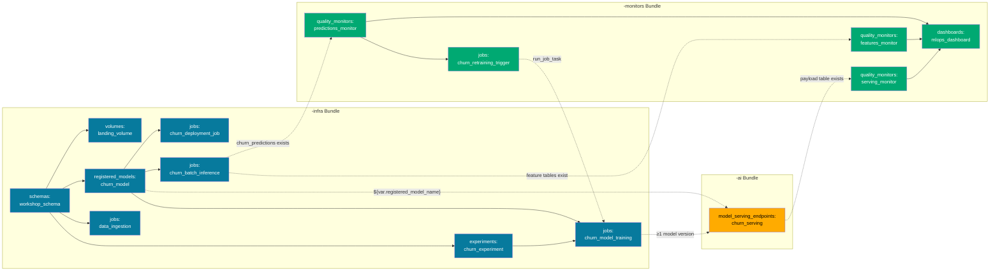

# 05 — Bundle Resource Dependency Graph

```mermaid
flowchart LR
    subgraph "-infra Bundle"
        SCHEMA["schemas:<br/>workshop_schema"]
        VOL["volumes:<br/>landing_volume"]
        EXP["experiments:<br/>churn_experiment"]
        MODEL["registered_models:<br/>churn_model"]
        INGEST["jobs:<br/>data_ingestion"]
        TRAIN["jobs:<br/>churn_model_training"]
        DEPLOY_JOB["jobs:<br/>churn_deployment_job"]
        BATCH["jobs:<br/>churn_batch_inference"]
    end

    subgraph "-ai Bundle"
        ENDPOINT["model_serving_endpoints:<br/>churn_serving"]
    end

    subgraph "-monitors Bundle"
        PRED_MON["quality_monitors:<br/>predictions_monitor"]
        FEAT_MON["quality_monitors:<br/>features_monitor"]
        SERV_MON["quality_monitors:<br/>serving_monitor"]
        DASHBOARD["dashboards:<br/>mlops_dashboard"]
        RETRAIN["jobs:<br/>churn_retraining_trigger"]
    end

    SCHEMA --> VOL
    SCHEMA --> EXP
    SCHEMA --> MODEL
    SCHEMA --> INGEST
    MODEL --> TRAIN
    EXP --> TRAIN
    MODEL --> DEPLOY_JOB
    MODEL --> BATCH
    MODEL -.->|"${var.registered_model_name}"| ENDPOINT
    TRAIN -.->|"≥1 model version"| ENDPOINT
    BATCH -.->|"churn_predictions exists"| PRED_MON
    BATCH -.->|"feature tables exist"| FEAT_MON
    ENDPOINT -.->|"payload table exists"| SERV_MON
    PRED_MON --> DASHBOARD
    FEAT_MON --> DASHBOARD
    SERV_MON --> DASHBOARD
    PRED_MON --> RETRAIN
    RETRAIN -.->|"run_job_task"| TRAIN

    style SCHEMA fill:#077A9D,color:#fff
    style VOL fill:#077A9D,color:#fff
    style EXP fill:#077A9D,color:#fff
    style MODEL fill:#077A9D,color:#fff
    style INGEST fill:#077A9D,color:#fff
    style TRAIN fill:#077A9D,color:#fff
    style DEPLOY_JOB fill:#077A9D,color:#fff
    style BATCH fill:#077A9D,color:#fff
    style ENDPOINT fill:#FFAB00,color:#000
    style PRED_MON fill:#00A972,color:#fff
    style FEAT_MON fill:#00A972,color:#fff
    style SERV_MON fill:#00A972,color:#fff
    style DASHBOARD fill:#00A972,color:#fff
    style RETRAIN fill:#00A972,color:#fff
```
