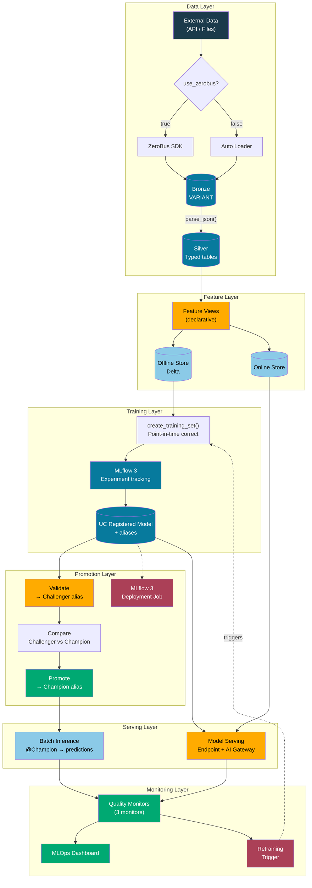

# 06 — End-to-End MLOps Lifecycle

```mermaid
flowchart TB
    subgraph "Data Layer"
        direction LR
        SRC["External Data<br/>(API / Files)"]
        GATE{"use_zerobus?"}
        ZB["ZeroBus SDK"]
        AL["Auto Loader"]
        BZ[("Bronze<br/>VARIANT")]
        SV[("Silver<br/>Typed tables")]
    end

    subgraph "Feature Layer"
        direction LR
        FV["Feature Views<br/>(declarative)"]
        OFF[("Offline Store<br/>Delta")]
        ON[("Online Store")]
    end

    subgraph "Training Layer"
        direction LR
        TS["create_training_set()<br/>Point-in-time correct"]
        MLFLOW["MLflow 3<br/>Experiment tracking"]
        UC_MODEL[("UC Registered Model<br/>+ aliases")]
    end

    subgraph "Promotion Layer"
        direction LR
        VALIDATE["Validate<br/>→ Challenger alias"]
        COMPARE["Compare<br/>Challenger vs Champion"]
        PROMOTE["Promote<br/>→ Champion alias"]
        DEPLOY_JOB["MLflow 3<br/>Deployment Job"]
    end

    subgraph "Serving Layer"
        direction LR
        BATCH_INF["Batch Inference<br/>@Champion → predictions"]
        ENDPOINT["Model Serving<br/>Endpoint + AI Gateway"]
    end

    subgraph "Monitoring Layer"
        direction LR
        Q_MON["Quality Monitors<br/>(3 monitors)"]
        DASH["MLOps Dashboard"]
        RETRAIN["Retraining<br/>Trigger"]
    end

    SRC --> GATE
    GATE -->|true| ZB --> BZ
    GATE -->|false| AL --> BZ
    BZ -->|"parse_json()"| SV
    SV --> FV
    FV --> OFF
    FV --> ON
    OFF --> TS --> MLFLOW --> UC_MODEL
    UC_MODEL --> VALIDATE --> COMPARE --> PROMOTE
    UC_MODEL -.-> DEPLOY_JOB
    PROMOTE --> BATCH_INF
    ON --> ENDPOINT
    UC_MODEL --> ENDPOINT
    BATCH_INF --> Q_MON
    ENDPOINT --> Q_MON
    Q_MON --> DASH
    Q_MON --> RETRAIN
    RETRAIN -.->|"triggers"| TS

    style SRC fill:#1B3A4B,color:#fff
    style BZ fill:#077A9D,color:#fff
    style SV fill:#077A9D,color:#fff
    style FV fill:#FFAB00,color:#000
    style OFF fill:#8BCAE7,color:#000
    style ON fill:#8BCAE7,color:#000
    style MLFLOW fill:#077A9D,color:#fff
    style UC_MODEL fill:#077A9D,color:#fff
    style VALIDATE fill:#FFAB00,color:#000
    style PROMOTE fill:#00A972,color:#fff
    style DEPLOY_JOB fill:#AB4057,color:#fff
    style BATCH_INF fill:#8BCAE7,color:#000
    style ENDPOINT fill:#FFAB00,color:#000
    style Q_MON fill:#00A972,color:#fff
    style DASH fill:#00A972,color:#fff
    style RETRAIN fill:#AB4057,color:#fff
```
