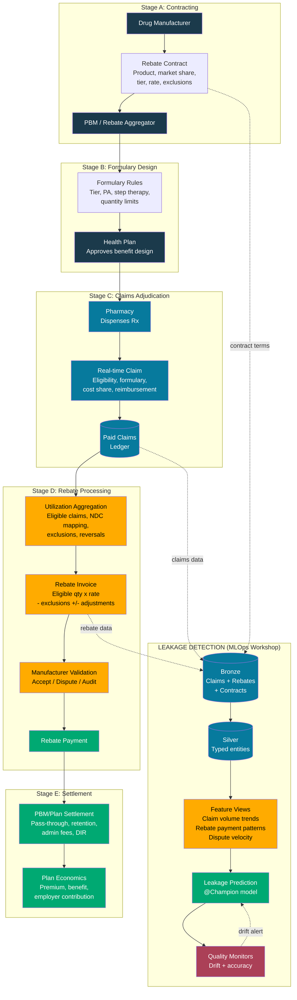

# 07 -- Rx Rebate Lifecycle: From Contract to Leakage Detection

```mermaid
flowchart TB
    subgraph "Stage A: Contracting"
        MFR["Drug Manufacturer"]
        CONTRACT["Rebate Contract<br/>Product, market share,<br/>tier, rate, exclusions"]
        PBM["PBM / Rebate Aggregator"]
    end

    subgraph "Stage B: Formulary Design"
        FORM["Formulary Rules<br/>Tier, PA, step therapy,<br/>quantity limits"]
        PLAN["Health Plan<br/>Approves benefit design"]
    end

    subgraph "Stage C: Claims Adjudication"
        RX["Pharmacy<br/>Dispenses Rx"]
        CLAIM["Real-time Claim<br/>Eligibility, formulary,<br/>cost share, reimbursement"]
        PAID[("Paid Claims<br/>Ledger")]
    end

    subgraph "Stage D: Rebate Processing"
        UTIL["Utilization Aggregation<br/>Eligible claims, NDC mapping,<br/>exclusions, reversals"]
        INVOICE["Rebate Invoice<br/>Eligible qty x rate<br/>- exclusions +/- adjustments"]
        VALIDATE["Manufacturer Validation<br/>Accept / Dispute / Audit"]
        PAYMENT["Rebate Payment"]
    end

    subgraph "Stage E: Settlement"
        SETTLE["PBM/Plan Settlement<br/>Pass-through, retention,<br/>admin fees, DIR"]
        ECON["Plan Economics<br/>Premium, benefit,<br/>employer contribution"]
    end

    subgraph "LEAKAGE DETECTION (MLOps Workshop)"
        direction LR
        BRONZE[("Bronze<br/>Claims + Rebates<br/>+ Contracts")]
        SILVER[("Silver<br/>Typed entities")]
        FEATURES["Feature Views<br/>Claim volume trends<br/>Rebate payment patterns<br/>Dispute velocity"]
        MODEL["Leakage Prediction<br/>@Champion model"]
        MONITOR["Quality Monitors<br/>Drift + accuracy"]
    end

    MFR --> CONTRACT --> PBM
    PBM --> FORM --> PLAN
    PLAN --> RX --> CLAIM --> PAID
    PAID --> UTIL --> INVOICE --> VALIDATE --> PAYMENT
    PAYMENT --> SETTLE --> ECON

    PAID -.->|"claims data"| BRONZE
    INVOICE -.->|"rebate data"| BRONZE
    CONTRACT -.->|"contract terms"| BRONZE
    BRONZE --> SILVER --> FEATURES --> MODEL --> MONITOR
    MONITOR -.->|"drift alert"| MODEL

    style MFR fill:#1B3A4B,color:#fff
    style PBM fill:#1B3A4B,color:#fff
    style PLAN fill:#1B3A4B,color:#fff
    style RX fill:#077A9D,color:#fff
    style CLAIM fill:#077A9D,color:#fff
    style PAID fill:#077A9D,color:#fff
    style UTIL fill:#FFAB00,color:#000
    style INVOICE fill:#FFAB00,color:#000
    style VALIDATE fill:#FFAB00,color:#000
    style PAYMENT fill:#00A972,color:#fff
    style SETTLE fill:#00A972,color:#fff
    style ECON fill:#00A972,color:#fff
    style BRONZE fill:#077A9D,color:#fff
    style SILVER fill:#077A9D,color:#fff
    style FEATURES fill:#FFAB00,color:#000
    style MODEL fill:#00A972,color:#fff
    style MONITOR fill:#AB4057,color:#fff
```
