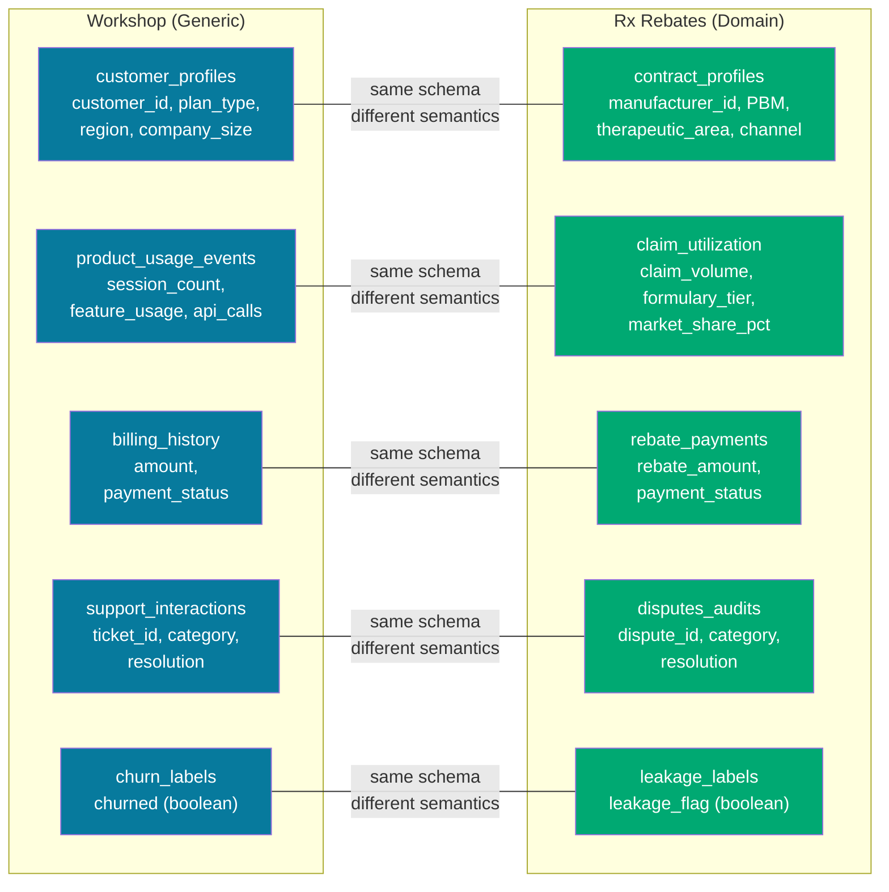

# 08 -- Workshop to Rx Rebates Domain Mapping

```mermaid
flowchart LR
    subgraph "Workshop (Generic)"
        direction TB
        W_CUST["customer_profiles<br/>customer_id, plan_type,<br/>region, company_size"]
        W_USAGE["product_usage_events<br/>session_count,<br/>feature_usage, api_calls"]
        W_BILL["billing_history<br/>amount,<br/>payment_status"]
        W_SUPP["support_interactions<br/>ticket_id, category,<br/>resolution"]
        W_LABEL["churn_labels<br/>churned (boolean)"]
    end

    subgraph "Rx Rebates (Domain)"
        direction TB
        R_CUST["contract_profiles<br/>manufacturer_id, PBM,<br/>therapeutic_area, channel"]
        R_USAGE["claim_utilization<br/>claim_volume, formulary_tier,<br/>market_share_pct"]
        R_BILL["rebate_payments<br/>rebate_amount,<br/>payment_status"]
        R_SUPP["disputes_audits<br/>dispute_id, category,<br/>resolution"]
        R_LABEL["leakage_labels<br/>leakage_flag (boolean)"]
    end

    W_CUST ---|"same schema<br/>different semantics"| R_CUST
    W_USAGE ---|"same schema<br/>different semantics"| R_USAGE
    W_BILL ---|"same schema<br/>different semantics"| R_BILL
    W_SUPP ---|"same schema<br/>different semantics"| R_SUPP
    W_LABEL ---|"same schema<br/>different semantics"| R_LABEL

    style W_CUST fill:#077A9D,color:#fff
    style W_USAGE fill:#077A9D,color:#fff
    style W_BILL fill:#077A9D,color:#fff
    style W_SUPP fill:#077A9D,color:#fff
    style W_LABEL fill:#077A9D,color:#fff
    style R_CUST fill:#00A972,color:#fff
    style R_USAGE fill:#00A972,color:#fff
    style R_BILL fill:#00A972,color:#fff
    style R_SUPP fill:#00A972,color:#fff
    style R_LABEL fill:#00A972,color:#fff
```
