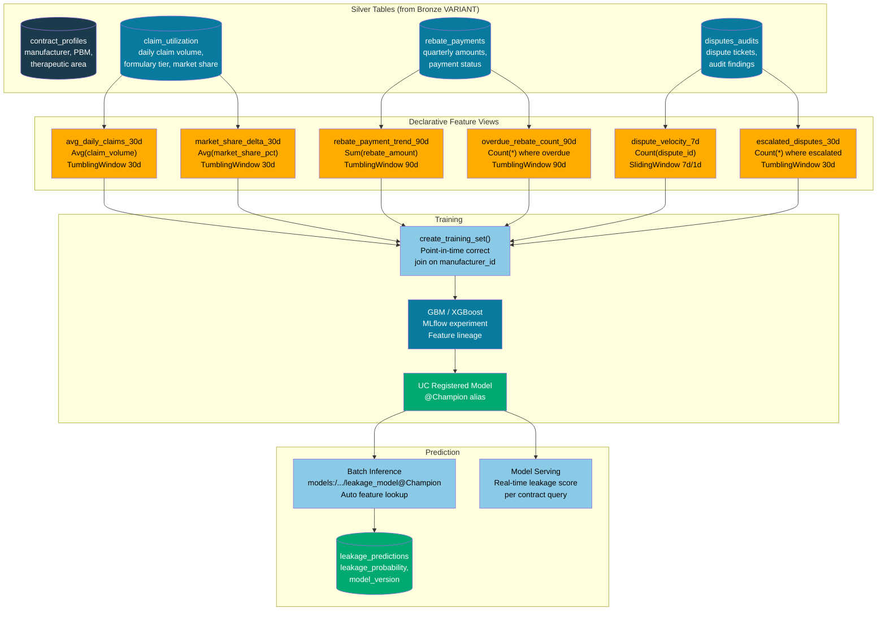

# 09 -- Rx Rebate Leakage: Feature Engineering to Prediction

```mermaid
flowchart TB
    subgraph "Silver Tables (from Bronze VARIANT)"
        CONTRACTS[("contract_profiles<br/>manufacturer, PBM,<br/>therapeutic area")]
        CLAIMS[("claim_utilization<br/>daily claim volume,<br/>formulary tier, market share")]
        REBATES[("rebate_payments<br/>quarterly amounts,<br/>payment status")]
        DISPUTES[("disputes_audits<br/>dispute tickets,<br/>audit findings")]
    end

    subgraph "Declarative Feature Views"
        F1["avg_daily_claims_30d<br/>Avg(claim_volume)<br/>TumblingWindow 30d"]
        F2["rebate_payment_trend_90d<br/>Sum(rebate_amount)<br/>TumblingWindow 90d"]
        F3["dispute_velocity_7d<br/>Count(dispute_id)<br/>SlidingWindow 7d/1d"]
        F4["market_share_delta_30d<br/>Avg(market_share_pct)<br/>TumblingWindow 30d"]
        F5["overdue_rebate_count_90d<br/>Count(*) where overdue<br/>TumblingWindow 90d"]
        F6["escalated_disputes_30d<br/>Count(*) where escalated<br/>TumblingWindow 30d"]
    end

    subgraph "Training"
        TS["create_training_set()<br/>Point-in-time correct<br/>join on manufacturer_id"]
        TRAIN["GBM / XGBoost<br/>MLflow experiment<br/>Feature lineage"]
        UC_MODEL["UC Registered Model<br/>@Champion alias"]
    end

    subgraph "Prediction"
        BATCH["Batch Inference<br/>models:/.../leakage_model@Champion<br/>Auto feature lookup"]
        SERVE["Model Serving<br/>Real-time leakage score<br/>per contract query"]
        PRED[("leakage_predictions<br/>leakage_probability,<br/>model_version")]
    end

    CLAIMS --> F1
    REBATES --> F2
    DISPUTES --> F3
    CLAIMS --> F4
    REBATES --> F5
    DISPUTES --> F6

    F1 & F2 & F3 & F4 & F5 & F6 --> TS
    TS --> TRAIN --> UC_MODEL
    UC_MODEL --> BATCH --> PRED
    UC_MODEL --> SERVE

    style CONTRACTS fill:#1B3A4B,color:#fff
    style CLAIMS fill:#077A9D,color:#fff
    style REBATES fill:#077A9D,color:#fff
    style DISPUTES fill:#077A9D,color:#fff
    style F1 fill:#FFAB00,color:#000
    style F2 fill:#FFAB00,color:#000
    style F3 fill:#FFAB00,color:#000
    style F4 fill:#FFAB00,color:#000
    style F5 fill:#FFAB00,color:#000
    style F6 fill:#FFAB00,color:#000
    style TS fill:#8BCAE7,color:#000
    style TRAIN fill:#077A9D,color:#fff
    style UC_MODEL fill:#00A972,color:#fff
    style BATCH fill:#8BCAE7,color:#000
    style SERVE fill:#8BCAE7,color:#000
    style PRED fill:#00A972,color:#fff
```
