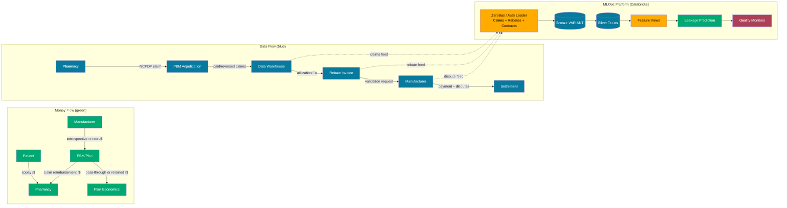

# 10 -- Rx Rebate: Money Flow vs Data Flow

```mermaid
flowchart LR
    subgraph "Money Flow (green)"
        direction TB
        M_PAT["Patient"] -->|"copay /$"| M_RX["Pharmacy"]
        M_PBM["PBM/Plan"] -->|"claim reimbursement /$"| M_RX
        M_MFR["Manufacturer"] -->|"retrospective rebate /$"| M_PBM
        M_PBM -->|"pass-through or retained /$"| M_PLAN["Plan Economics"]
    end

    subgraph "Data Flow (blue)"
        direction TB
        D_RX["Pharmacy"] -->|"NCPDP claim"| D_PBM["PBM Adjudication"]
        D_PBM -->|"paid/reversed claims"| D_DW["Data Warehouse"]
        D_DW -->|"utilization file"| D_INVOICE["Rebate Invoice"]
        D_INVOICE -->|"validation request"| D_MFR["Manufacturer"]
        D_MFR -->|"payment + disputes"| D_SETTLE["Settlement"]
    end

    subgraph "MLOps Platform (Databricks)"
        direction TB
        INGEST["ZeroBus / Auto Loader<br/>Claims + Rebates + Contracts"]
        BRONZE[("Bronze VARIANT")]
        SILVER[("Silver Tables")]
        FV["Feature Views"]
        PRED["Leakage Prediction"]
        MON["Quality Monitors"]
    end

    D_DW -.->|"claims feed"| INGEST
    D_INVOICE -.->|"rebate feed"| INGEST
    D_MFR -.->|"dispute feed"| INGEST
    INGEST --> BRONZE --> SILVER --> FV --> PRED --> MON

    style M_PAT fill:#00A972,color:#fff
    style M_RX fill:#00A972,color:#fff
    style M_PBM fill:#00A972,color:#fff
    style M_MFR fill:#00A972,color:#fff
    style M_PLAN fill:#00A972,color:#fff
    style D_RX fill:#077A9D,color:#fff
    style D_PBM fill:#077A9D,color:#fff
    style D_DW fill:#077A9D,color:#fff
    style D_INVOICE fill:#077A9D,color:#fff
    style D_MFR fill:#077A9D,color:#fff
    style D_SETTLE fill:#077A9D,color:#fff
    style INGEST fill:#FFAB00,color:#000
    style BRONZE fill:#077A9D,color:#fff
    style SILVER fill:#077A9D,color:#fff
    style FV fill:#FFAB00,color:#000
    style PRED fill:#00A972,color:#fff
    style MON fill:#AB4057,color:#fff
```
